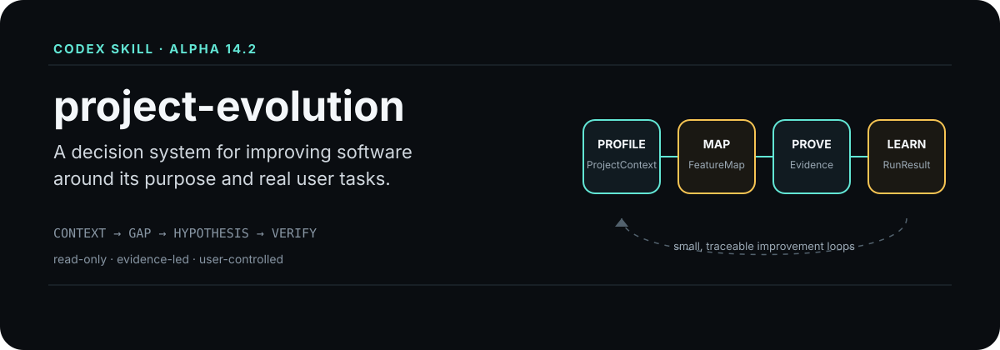
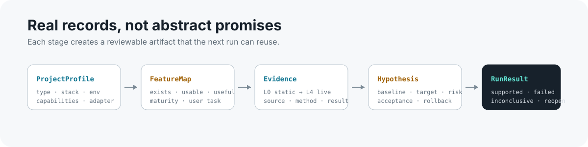

<p align="right">
  <a href="./README.md"></a>
  &nbsp;|&nbsp;
  <strong>English</strong>
</p>

<p align="center">
  
</p>

<p align="center">
  <strong>An evidence-led Codex Skill for continuous improvement across software projects.</strong>
</p>

`project-evolution` does not treat a project as something to audit once and forget. It builds a bounded, traceable, repeatable improvement loop around the project's real purpose and user tasks: understand the project, find a meaningful gap, research mature references, propose a testable change, and bring the result into the next run.

<table>
  <tr>
    <td width="25%"><strong>Websites / Web Apps</strong><br>User flows, conversion, operations, content, and experience</td>
    <td width="25%"><strong>Mobile Apps</strong><br>First use, core tasks, retention, and feedback</td>
    <td width="25%"><strong>Skills / Prompts</strong><br>Inputs, judgement, outputs, and long-term reuse</td>
    <td width="25%"><strong>Automation / Other</strong><br>Reliability, recovery, human checkpoints, and value</td>
  </tr>
</table>

## Why it is not a normal review

| Common review | project-evolution |
| --- | --- |
| Starts from folders, code, or generic checklists | Starts from the purpose, target users, and a real task |
| Treats "exists" as "works" | Separates existence, usability, usefulness, and maturity |
| Produces a batch of generic advice | Researches one evidence-supported focus at a time |
| Ends at a recommendation | Keeps the baseline, acceptance rule, user decision, and later result |
| Treats static scans or passing tests as experience proof | Labels evidence from L0 to L4 and makes unverified limits explicit |

## The evolution loop

| 1. Understand | 2. Find the gap | 3. Research and propose | 4. User decides and implements | 5. Verify with the same criteria |
| --- | --- | --- | --- | --- |
| Purpose, users, and real tasks | Function, experience, reliability, and value | Mature references, baseline, goal, and risk | Accept, defer, reject, or request evidence | Support, fail, inconclusive, or reopen |

Every run has one clear focus. With no evidence, no current task, or no user decision to support, the Skill stops explicitly instead of manufacturing a broad review report.

## What it examines

<table>
  <tr>
    <td width="33%"><strong>Purpose and product value</strong><br>Does the work still serve the intended purpose? Which capability is worth improving next?</td>
    <td width="33%"><strong>Real user tasks and experience</strong><br>Can users finish important tasks without getting stuck, taking detours, misunderstanding, or giving up?</td>
    <td width="33%"><strong>Feature maturity</strong><br>Is the feature complete, rigorous, explainable, and comparable with mature references?</td>
  </tr>
  <tr>
    <td><strong>Logic, reliability, and security</strong><br>Are errors, data, permissions, recovery paths, and risk boundaries under control?</td>
    <td><strong>Research and evidence</strong><br>Are sources, applicability, adoption reasons, and conclusions traceable?</td>
    <td><strong>Learning and reuse</strong><br>Do verified lessons make the next run more accurate and reduce rework?</td>
  </tr>
</table>

## Real records, not marketing labels

<p align="center">
  
</p>

`ProjectProfile`, `FeatureMap`, `Evidence`, `Hypothesis`, and `RunResult` are real records in the Skill's data contract. They preserve project identity, feature maturity, evidence levels, improvement hypotheses, and verification outcomes for the next run.

## What it does and will not do on its own

| It does | It does not do on its own |
| --- | --- |
| Read project context, static page signals, and persisted task records | Modify business code, deploy, push, or write to production |
| Organize focused research and mature references around a concrete gap | Present static scans or automated tests as real user experience proof |
| Produce human-readable Markdown reports and traceable records | Present a historic task as a current request or decide product direction for the user |
| Keep decision, baseline, and later-verification entry points | Manufacture findings or generic recommendations without evidence |

## First use

Call `$project-evolution` in Codex with a project directory. For the first local pass, run the read-only static adapter:

```powershell
powershell -NoProfile -ExecutionPolicy Bypass -File scripts/static-project-adapter.ps1 `
  -ProjectPath "C:\path\to\your-project" `
  -ProjectId "demo-project" `
  -OutputDir "C:\path\to\your-project\docs\project-evolution"
```

Then open `latest-report.md`. It is the human-facing entry point; structured records remain available for traceability and validation.

For a focused run:

```text
Use $project-evolution on this project.
Read the current project context and choose one high-value real user task.
Research only the concrete gap you can support with evidence.
Propose improvements with a baseline and acceptance criteria.
Do not modify code or deploy anything. Stop after the report.
```

## Current status

This is an **Alpha / Personal Limited Release**. It currently supports project-context extraction, persisted-task identification, business feature mapping, research planning, research records, and human-readable reports.

Automatic change detection, target-user testing, and a complete before/after verification loop are not implemented yet. It is not an autonomous coding or deployment agent, and it makes no promise of a specific sales, conversion, or business outcome.

## Repository map

```text
SKILL.md                         Skill entry point
references/workflow.md           State machine and operating rules
references/project-evolution.schema.json
                                 Data contract
scripts/extract_project_context.ps1
                                 Read-only context extraction
scripts/static-project-adapter.ps1
                                 Conservative static adapter
scripts/validate_records.ps1    Local contract checks
examples/                        Safe sample records
tests/                           Test notes
```

## Verification

Windows PowerShell 5.1 and PowerShell 7 are supported:

```powershell
powershell -NoProfile -ExecutionPolicy Bypass -File scripts/test_project_context.ps1
powershell -NoProfile -ExecutionPolicy Bypass -File scripts/test_contracts.ps1
powershell -NoProfile -ExecutionPolicy Bypass -File scripts/test_validator.ps1
powershell -NoProfile -ExecutionPolicy Bypass -File scripts/test_user_input.ps1
powershell -NoProfile -ExecutionPolicy Bypass -File scripts/test_static_adapter.ps1
```

## Data and privacy

Keep real customer leads, emails, phone numbers, cookies, tokens, passwords, secrets, and production logs out of this repository. Store project-specific records in the reviewed project and inspect them before committing.

## Roadmap

- Project-specific adapters for more project types;
- Automatic change detection across runs;
- Reusable before/after baselines;
- Real target-user task validation;
- Multi-run reports and stronger evidence synthesis.

## License

MIT License. See [LICENSE](LICENSE).
