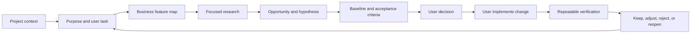

<p align="right">
  <strong>English</strong> · <a href="./README.zh-CN.md">简体中文</a>
</p>

<p align="center">
  
</p>

**A purpose-driven Codex Skill for continuous software improvement.**

`project-evolution` turns a repository and its real user tasks into a bounded improvement loop: understand the project, find a meaningful gap, research relevant references, propose a testable change, and verify what happened next.

## The proof

<p align="center">
  
</p>

These are real records in the Skill's data contract, not marketing labels. Each record has a defined role, evidence requirements, and a place in the next run.

## Why it is different

| Common review | project-evolution |
| --- | --- |
| Starts from folders, files, or generic checklists | Starts from the project's purpose and a real user task |
| Treats “exists” as “works” | Separates existence, usability, usefulness, and maturity |
| Produces advice without a comparison point | Links the gap to focused research and mature references |
| Ends with a recommendation | Creates a baseline, acceptance rule, decision, and later result |
| Uses automation output as proof of experience | Labels evidence from static inspection to live user behavior |

## How the loop works



The loop is intentionally bounded. It does not expand into a full-project audit when there is no evidence or decision to support it.

## First use

In Codex, call `$project-evolution` with a project directory. For a first local pass, use the read-only adapter:

```powershell
powershell -NoProfile -ExecutionPolicy Bypass -File scripts/static-project-adapter.ps1 `
  -ProjectPath "C:\path\to\your-project" `
  -ProjectId "demo-project" `
  -OutputDir "C:\path\to\your-project\docs\project-evolution"
```

Then open `latest-report.md`. It is the human-facing entry point. JSON records remain available for traceability and validation.

For a focused run, use a prompt like:

```text
Use $project-evolution on this project.
Read the current project context and choose one high-value user task.
Research only the concrete gap you can support with evidence.
Propose improvements with a baseline and acceptance criteria.
Do not modify code or deploy anything. Stop after the report.
```

## Run modes

| Mode | Best for | Scope |
| --- | --- | --- |
| `quick` | A lightweight status pass | History + one focus; no active research |
| `normal` | A regular improvement cycle | One focus, limited verification, one research goal |
| `deep` | A high-value or uncertain gap | One focus, several tasks, bounded source research |

## Current boundaries

This is an **Alpha / Personal Limited Release**. It is not:

- an autonomous coding or deployment agent;
- a replacement for product decisions or target-user research;
- proof that a static scan means a feature is good to use;
- a promise of better sales, conversion, or business results.

Project-specific adapters are still needed for automatic change detection, real target-user testing, and complete before/after verification.

## Repository map

```text
SKILL.md                         Skill entry point
references/workflow.md           State machine and operating rules
references/project-evolution.schema.json
                                 Data contract
scripts/extract_project_context.ps1
                                 Read-only context extraction
scripts/static-project-adapter.ps1
                                 Conservative static adapter
scripts/validate_records.ps1    Local contract checks
examples/                        Safe sample records
tests/                           PowerShell test scripts
```

## Verification

Windows PowerShell 5.1 and PowerShell 7 are supported:

```powershell
powershell -NoProfile -ExecutionPolicy Bypass -File scripts/test_project_context.ps1
powershell -NoProfile -ExecutionPolicy Bypass -File scripts/test_contracts.ps1
powershell -NoProfile -ExecutionPolicy Bypass -File scripts/test_validator.ps1
powershell -NoProfile -ExecutionPolicy Bypass -File scripts/test_user_input.ps1
powershell -NoProfile -ExecutionPolicy Bypass -File scripts/test_static_adapter.ps1
```

## Data and privacy

Keep real customer leads, emails, phone numbers, cookies, tokens, passwords, secrets, and production logs out of this repository. Store project-specific records in the project being reviewed, and inspect them before committing.

## Roadmap

- Project-specific adapters for more project types.
- Automatic change detection across runs.
- Reusable before/after baselines.
- Real target-user task validation.
- Multi-run reports and stronger evidence synthesis.

## License

MIT License. See [LICENSE](LICENSE).
