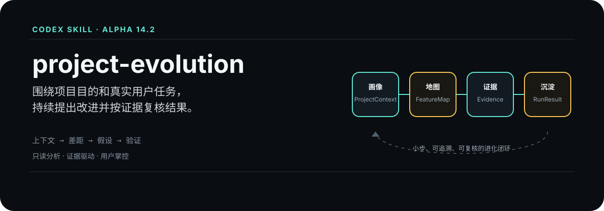
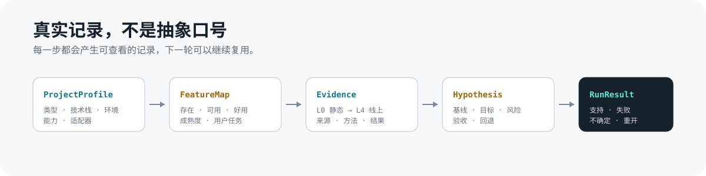

<p align="right">
  <strong>简体中文</strong>
  &nbsp;|&nbsp;
  <a href="./README.en.md"></a>
</p>

<p align="center">
  
</p>

<p align="center">
  <strong>一个适用于各类软件项目的证据驱动持续进化 Codex Skill。</strong>
</p>

`project-evolution` 不把项目当成一次性“审查完就结束”的对象。它围绕项目真正要解决的问题和真实用户任务，建立一个可停止、可追溯、可复核的改进闭环：读懂项目，发现值得解决的差距，调研成熟参考，提出可验证的改变，再把结果带回下一轮。

<table>
  <tr>
    <td width="25%"><strong>网站 / Web App</strong><br>用户流程、转化、后台、内容与体验</td>
    <td width="25%"><strong>移动 App</strong><br>首次使用、核心任务、留存与反馈</td>
    <td width="25%"><strong>Skill / 提示词</strong><br>输入、判断、输出与长期复用</td>
    <td width="25%"><strong>自动化工具 / 其他项目</strong><br>可靠性、失败恢复、人工节点与价值</td>
  </tr>
</table>

## 为什么不是普通审查

| 普通审查 | project-evolution |
| --- | --- |
| 从目录、代码或通用清单开始 | 从项目目的、目标用户和真实任务开始 |
| 把“功能存在”当成“项目可用” | 分开判断存在、可用、好用和成熟度 |
| 给一批泛化建议 | 只围绕当前有证据支持的一个主焦点研究 |
| 输出建议后结束 | 保留基线、验收条件、用户决定和后续结果 |
| 把静态扫描或测试通过当成体验证明 | 标记 L0 到 L4 证据等级，明确哪些结论尚未验证 |

## 项目进化闭环

| 1. 理解项目 | 2. 找到差距 | 3. 研究并提出改变 | 4. 用户决定与执行 | 5. 按同一标准复核 |
| --- | --- | --- | --- | --- |
| 目的、用户和真实任务 | 功能、体验、可靠性与价值 | 成熟参考、基线、目标与风险 | 接受、暂缓、拒绝或补充证据 | 支持、失败、不确定或重开 |

每一轮只处理一个明确焦点。没有证据、没有当前任务或没有需要支持的用户决定时，Skill 会明确停下，不会为了显得专业而扩展成大而全的审查报告。

## 它会关注什么

<table>
  <tr>
    <td width="33%"><strong>项目目的与产品价值</strong><br>功能是否真正服务设计目的，是否存在值得补足的能力。</td>
    <td width="33%"><strong>真实用户任务与体验</strong><br>用户是否会卡住、绕路、误解或放弃；完成不等于好用。</td>
    <td width="33%"><strong>功能成熟度</strong><br>功能是否完整、严谨、可解释，并能与成熟案例对比。</td>
  </tr>
  <tr>
    <td><strong>逻辑、可靠性与安全</strong><br>错误、数据、权限、恢复路径和风险边界是否可控。</td>
    <td><strong>研究与证据</strong><br>参考来源、适用范围、采用理由和结论是否可追溯。</td>
    <td><strong>学习与复用</strong><br>有效经验是否被沉淀，让下一轮判断更准确、返工更少。</td>
  </tr>
</table>

## 真实记录，而不是宣传标签

<p align="center">
  
</p>

`ProjectProfile`、`FeatureMap`、`Evidence`、`Hypothesis` 和 `RunResult` 都是 Skill 数据契约中的真实记录。它们分别记录项目画像、功能成熟度、证据等级、改进假设和复核结果，让下一轮不必从头猜测。

## 它会做什么，以及不会越过什么边界

| 会做 | 不会擅自做 |
| --- | --- |
| 读取项目上下文、静态页面线索和已落盘任务 | 自动修改业务代码、部署、推送或写入线上环境 |
| 围绕具体差距整理研究与成熟参考 | 把静态扫描、自动化测试冒充真实用户体验通过 |
| 输出面向用户的 Markdown 报告和可追溯记录 | 把历史任务冒充当前需求，或替用户决定产品方向 |
| 记录用户决定、基线和后续复核入口 | 在没有证据时硬凑“发现”或泛化建议 |

## 第一次使用

在 Codex 中调用 `$project-evolution`，并指定一个项目目录。首次接入时，可先运行只读静态适配器：

```powershell
powershell -NoProfile -ExecutionPolicy Bypass -File scripts/static-project-adapter.ps1 `
  -ProjectPath "C:\你的项目路径" `
  -ProjectId "demo-project" `
  -OutputDir "C:\你的项目路径\docs\project-evolution"
```

然后打开 `latest-report.md`。这是给项目使用者查看的主入口；结构化记录用于追溯和校验。

一轮定向进化可以这样开始：

```text
使用 $project-evolution 分析这个项目。
读取当前项目上下文，并选择一个高价值的真实用户任务。
只围绕有证据支持的具体差距做调研。
提出带改前基线和验收条件的改进建议。
不要修改代码或部署，报告完成后停止。
```

## 当前状态

当前版本是 **Alpha / 个人有限发布版**。已具备项目上下文提取、已落盘任务识别、业务功能地图、研究计划、研究记录和用户可读报告能力。

尚未完成自动变化检测、真实目标用户测试和完整的改前改后验证闭环。它不是自动编码或自动部署代理，也不承诺销售、转化或商业结果一定提升。

## 仓库结构

```text
SKILL.md                         Skill 入口
references/workflow.md           状态机和运行规则
references/project-evolution.schema.json
                                 数据契约
scripts/extract_project_context.ps1
                                 只读项目上下文提取
scripts/static-project-adapter.ps1
                                 保守的静态适配器
scripts/validate_records.ps1    本地契约校验
examples/                        安全示例数据
tests/                           测试说明
```

## 验证

支持 Windows PowerShell 5.1 和 PowerShell 7：

```powershell
powershell -NoProfile -ExecutionPolicy Bypass -File scripts/test_project_context.ps1
powershell -NoProfile -ExecutionPolicy Bypass -File scripts/test_contracts.ps1
powershell -NoProfile -ExecutionPolicy Bypass -File scripts/test_validator.ps1
powershell -NoProfile -ExecutionPolicy Bypass -File scripts/test_user_input.ps1
powershell -NoProfile -ExecutionPolicy Bypass -File scripts/test_static_adapter.ps1
```

## 数据与隐私

不要把真实客户线索、邮箱、电话、Cookie、Token、密码、密钥或生产日志提交到本仓库。项目专属记录应保存在被审查的项目中，提交前请人工检查。

## 路线图

- 面向更多项目类型的专用适配器；
- 跨轮次自动检测项目变化；
- 复用改前与改后基线；
- 真实目标用户任务验收；
- 多轮报告更新与更强的证据综合。

## 许可证

MIT License，见 [LICENSE](LICENSE)。
