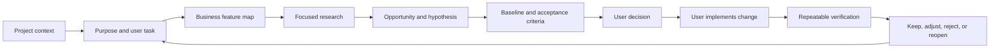

# project-evolution

**A purpose-driven Codex Skill for continuous software improvement.**

[中文说明](README.zh-CN.md) · [Workflow](references/workflow.md) · [Changelog](CHANGELOG.md)

> Research the gap. Propose the change. Verify the result.

`project-evolution` helps a software project improve around its real purpose and users' real tasks. It combines project context, business feature mapping, focused research, improvement hypotheses, and later verification into one traceable loop.

## What it does

- Builds a project profile from the repository and available project records.
- Separates current, pending, and recently completed work.
- Maps business capabilities, not just folders and source files.
- Compares a concrete gap with relevant mature references.
- Produces an evidence-backed opportunity, hypothesis, baseline, and Markdown report.
- Preserves decisions and verification history for the next run.

## What it does not do

This is a **decision-support Skill**, not an autonomous coding platform. It does not:

- edit business code;
- deploy or write to production;
- push to GitHub;
- decide product direction for you;
- claim that static checks prove real user satisfaction.

The current release is **Alpha / Personal Limited Release**. Automatic change detection, real target-user testing, and a complete before/after verification loop still require project-specific adapters.

## The evolution loop



Every run has a bounded focus, explicit evidence, a stopping condition, and a clear next action.

## Quick start

Run the read-only adapter against a project. It writes project-evolution records to the output directory you choose.

```powershell
powershell -NoProfile -ExecutionPolicy Bypass -File scripts/static-project-adapter.ps1 `
  -ProjectPath "C:\path\to\your-project" `
  -ProjectId "demo-project" `
  -OutputDir "C:\path\to\your-project\docs\project-evolution"

powershell -NoProfile -ExecutionPolicy Bypass -File scripts/extract_project_context.ps1 `
  -ProjectPath "C:\path\to\your-project" `
  -ProjectId "demo-project" `
  -OutputDir "C:\path\to\your-project\docs\project-evolution"
```

Then open `latest-report.md`. It is the human-facing entry point; JSON files are retained for traceability and machine validation.

## Run modes

| Mode | Use when | Scope |
| --- | --- | --- |
| `quick` | You need a lightweight check | History + one focus; no active research |
| `normal` | You want a regular improvement cycle | One focus, limited verification, one research goal |
| `deep` | A high-value or uncertain gap needs study | One focus, several tasks, bounded source research |

## Repository map

```text
SKILL.md                         Skill entry point
references/workflow.md           State machine and operating rules
references/project-evolution.schema.json
                                 Data contract
scripts/extract_project_context.ps1
                                 Read-only context extraction
scripts/static-project-adapter.ps1
                                 Conservative static adapter
scripts/validate_records.ps1    Local contract checks
examples/                        Safe sample records
tests/                           PowerShell test scripts
```

## Verification

Windows PowerShell 5.1 and PowerShell 7 are supported:

```powershell
powershell -NoProfile -ExecutionPolicy Bypass -File scripts/test_project_context.ps1
powershell -NoProfile -ExecutionPolicy Bypass -File scripts/test_contracts.ps1
powershell -NoProfile -ExecutionPolicy Bypass -File scripts/test_validator.ps1
powershell -NoProfile -ExecutionPolicy Bypass -File scripts/test_user_input.ps1
powershell -NoProfile -ExecutionPolicy Bypass -File scripts/test_static_adapter.ps1
```

## Data and privacy

Keep real customer leads, emails, phone numbers, cookies, tokens, passwords, secrets, and production logs out of this repository. Store project-specific records in the project being reviewed, and inspect them before committing.

## Roadmap

- Project-specific adapters for more project types.
- Automatic change detection across runs.
- Reusable before/after baselines.
- Real target-user task validation.
- Multi-run reports and stronger evidence synthesis.

## License

MIT License. See [LICENSE](LICENSE).
